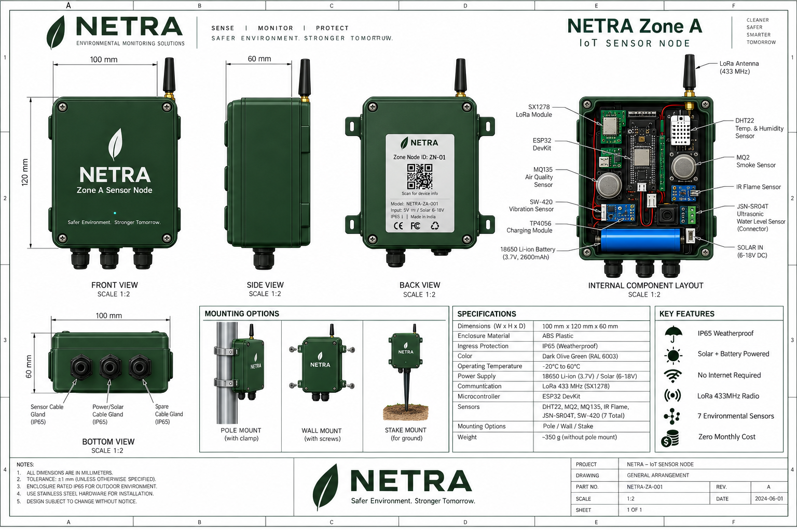
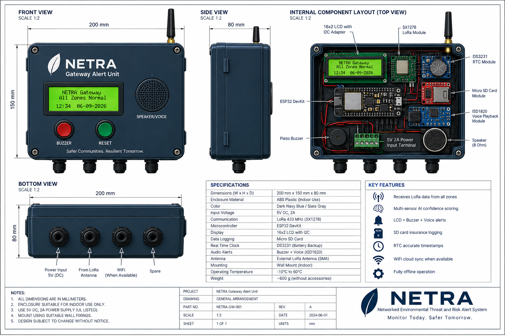

# NETRA — Hardware Design

Official CAD datasheets for all NETRA hardware units.

## Zone A — IoT Sensor Node

| Spec | Value |
|------|-------|
| Part No. | NETRA-ZA-001 Rev.A |
| Dimensions | 100 × 120 × 60 mm |
| Enclosure | ABS Plastic, IP65 Weatherproof |
| Color | Dark Olive Green (RAL 6003) |
| Power | 18650 Li-ion (3.7V) + Solar (6–18V) |
| Communication | LoRa 433 MHz (SX1278) |
| Sensors | DHT22, MQ2, MQ135, IR Flame, JSN-SR04T, SW-420 (7 total) |
| Mounting | Pole / Wall / Stake |
| Weight | ~350g (without mount) |
| Operating Temp | -20°C to 60°C |

## Gateway — Alert Unit

| Spec | Value |
|------|-------|
| Part No. | NETRA-GW-001 Rev.A |
| Dimensions | 200 × 150 × 80 mm |
| Enclosure | ABS Plastic (Indoor) |
| Color | Dark Navy Blue / Slate Gray |
| Power | 5V DC, 2A |
| Communication | LoRa 433 MHz (SX1278) |
| Display | 16×2 LCD with I2C |
| Audio | Buzzer + ISD1820 Voice Playback |
| Data Logging | Micro SD Card |
| Clock | DS3231 RTC (battery backup) |
| Mounting | Wall Mount (Indoor) |
| Weight | ~600g (without accessories) |
| Operating Temp | -10°C to 60°C |
